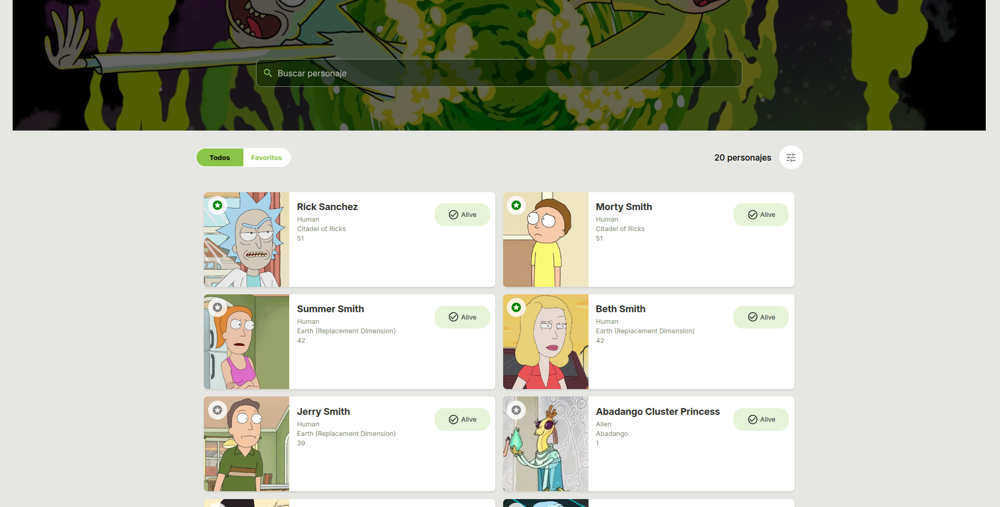

# 🧩 Rick and Morty Character Finder

Proyecto frontend para búsqueda de personajes de Rick and Morty usando la API pública. Permite filtrar por nombre, visualizar información clave y probar patrones de arquitectura limpia con Zustand, TypeScript y Material UI.

## 🚀 **Tecnologías utilizadas**

- **React 18** + **Vite**
- **TypeScript**
- **Material UI (MUI)**
- **Zustand** (state management)
- **Axios**
- **i18next** (traducción)

---

## 📸 **Vista previa**

 

---

## ⚙️ **Instalación**

1. **Clonar el repositorio**

```bash
git clone https://github.com/4ng13-60rd1770/api-RM-MUI.git


2.** Instalar el proyecto**

npm install
# o
yarn install


3.**npm run dev **
# o
yarn dev

4.**http://localhost:5173**

API utilizada
Rick and Morty API
